

# Fika

## Code Institute - Hackathon May 2022
Fika is a platform for connecting family members and friends. People use Fika to plan events together, and to stay connected.

We want to encourage you to nurture the relationships you already have through real world events and hanging out. Our platform is one space for all your planning needs within your circle of friends and family.

# Contents

* [Objective](<#objective>)
* [User Experience UX](<#user-experience-ux>)
    * [Target Audience](<#target-audience>)
    * [User Stories](<#user-stories>)
* [Design](<#design>)
    * [Site Structure](<#site-structure>)
    * [Colour Scheme](<#colour-scheme>)
    * [Typography](<#typography>)
    * [Imagery](<#imagery>)
    * [Wireframes](<#wireframes>)
* [Features](<#features>)
    * [Navigation Menu](<#navigation-menu>)
    * [Home Page](<#home-page>)
    * [About Page](<#about-page>)
    * [Login Page](<#login-page>)
    * [Register Page](<#register-page>)
    * [Profile Page](<#profile-page>)
    * [Contact Page](<#contact-page>)
    * [Footer](<#footer>)
    * [Create Events](<#create-events>)
    * [Friend System](<#friend-system>)
* [Future Features](<#future-features>)
* [Technologies Used](<#technologies-used>)
* [Acknowledgements](<#acknowledgements>)
    * [Developer Team](<#developer-team>)

# Objective:

In the Swedish culture, the word fika encompasses many meanings. It has been described as, a concept, a state of mind, and, an attitude. It is the act of consciously taking time in your day to meet with friends or colleagues to share a beverage and have something to eat. Fika has become a daily practice in Sweden, so much so that businesses have adopted this into their daily running. 

In today’s busy world, time slips away before we realise it. It’s easy to get caught up and miss out on spending time with friends and family. By using our platform, we hope it will help users stay connected with their friends and family by encouraging them to make time for themself and those valuable experiences with others. 

The three main objectives are:

* ## To give users the power to connect with friends and family.
    Our plan is to help users support and build on relationships they already have with friends and family. This is done by encouraging them to plan and create events that they want to experience with their circle of friends.
* ## To help prevent loneliness and isolation.
    Whether it is a pandemic or a busy lifestyle, loneliness can affect anyone. We want you to reach out to people you already know, to help support you. Our platform will give you the power and a voice to do this, by joining or creating an event in your circle of friends whenever you feel out of touch with them.
* ## To encourage you to get up and do something!
    Our platform is based on the creation of events. They can be as big or as small, as elaborate or as simple as you want them to be. The important thing is that you engage and connect with people and make it part of your routine.

[Back to top](<#contents>)

# User Experience (UX):

## Target Audience

* Users that are looking for a platform for connecting family members and friends. 
* Users that are looking to plan events and invite their friends and family.
* Users that are looking to join events their friends and family have organised.

## User Stories

### First Time Visitor Goals

* Intuitively navigate the website.
* Understand what the website is about.
* Create a new account without difficulty.
* Sign in to the new account.
* Add friends and family connections.
* Log out of the account when finished.

### Returning Visitor Goals

* Be able to sign in to the account.
* Create a new event
* View and edit existing events.
* View and join/accept other family and friend’s events.
* Be able to add more friends and family connections.

## Design Choices

### Site Structure

Fika consists of a 5 page website that the user can navigate between via the navigation bar. The Home page is the default loading page. The Logo is also linked to the Home Page. On the left hand side of the header is the logo. On the right hand side of the header are four navigation links named: Home, Blog, About and Login. There is also a Register button for first time users.

### Colour Scheme

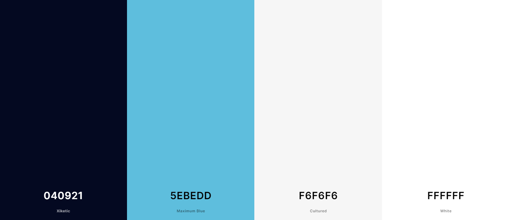

The colour scheme used for this project was generated on [Coolors](https://coolors.co/).

* Xiketic `#040921`
* Maximum Blue `#5EBEDD`
* Cultured `#F6F6F6`
* White `#FFFFFF`

### Typography

We have chosen the font **Alfa Slab One** for the headings on each page.
The font **Roboto Slab** has been chosen for all the content of the project.
The fonts were sourced from [Google Fonts](https://fonts.google.com/).

### Imagery
Hand with clock image on about page - Photo by Elena Koycheva on [Unsplash](https://unsplash.com/photos/VmcIMhuWCac)

Friends in cafe with laptops image on about page - Photo by Brooke Cagle on [Unsplash](https://unsplash.com/photos/g1Kr4Ozfoac)

### Wireframes

High Fidelity Home Page Wireframes 

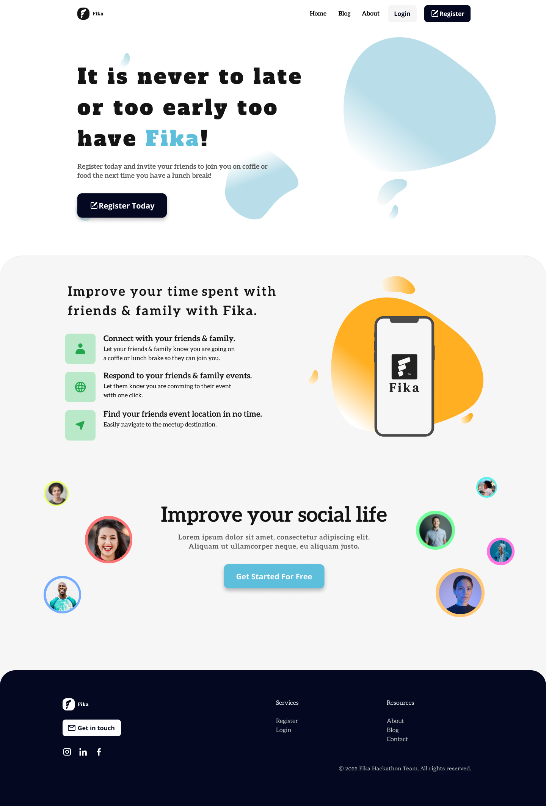

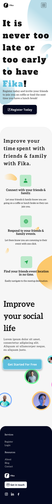

High Fidelity About Page Wireframes 

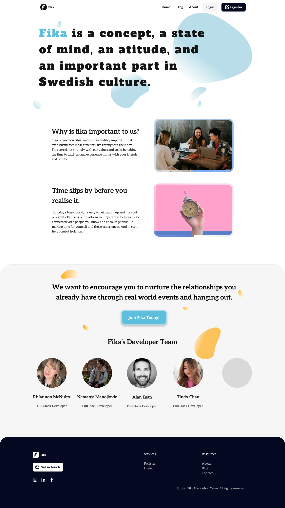

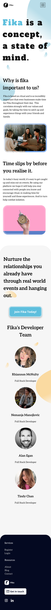

[Back to top](<#contents>)

# Features

Fika is designed and structured like a typical website, making it very natural and intuitive to use to entice the user to register with call to actions and text.

Each page has a clear design structure. The language, colour and design used is intended to be friendly and easy to understand.

This is a mobile first, fully responsive website. 

## Navigation Menu

The Navigation bar presents the website logo which links back to the Home page.

The Navigation bar can take the user directly to the Home page, Blog page, About page, Login page and Register page when the user isn't signed in.

Once the user has signed in, the Navigation bar can take the user directly to the Home page, Blog page, About page, and their Profile page. The Log out function is also located on the Navigation bar when the user is logged in.

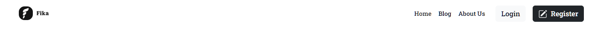

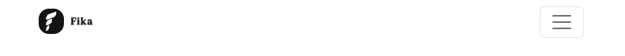

## Home Page 

The Home Page is the landing page of the website and the first part that the user will see. It is designed to be welcoming and the purpose of the website easily determined.

There is a large hero background image upon which our main slogan, as well as the register call to action button is overlayed.

The section below the fold has some key information on our website, as well as another call to action text and button. 

No matter what part of the page you are on there is a call to action button so the user can easily register if they so wish.

Each section is fully responsive, with the multiple column content naturally falling into single column content.

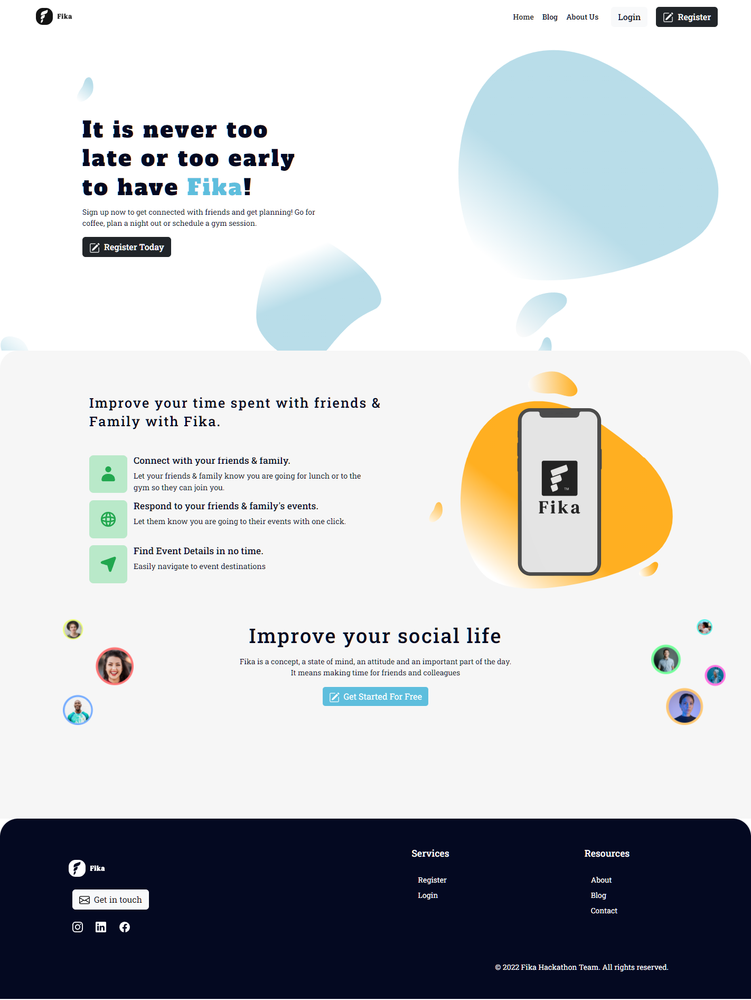

## About Page

The About page is accessible from both the Navbar and Footer of the site.

Again, the design and imagery is consistent throughout the pages, as we have the same design as the Home Page, with a large Hero section with our main heading text on top.

This heading text gives a succinct summary of what the word Fika is, and it is designed to grab the users attention and of course scroll below the screen fold.

The second section of the About page is more detailed information on What Fika is, where the word comes from and how it correlates with our website.
These are short informative paragraphs.

The last section is a 'Meet the Developers' section, with our ethos as well as our profile picture and title. Seeing the developers adds a bit of humanity and relatability to our website, as well as creating a virtual connection to our users. A face to a product/service as such.

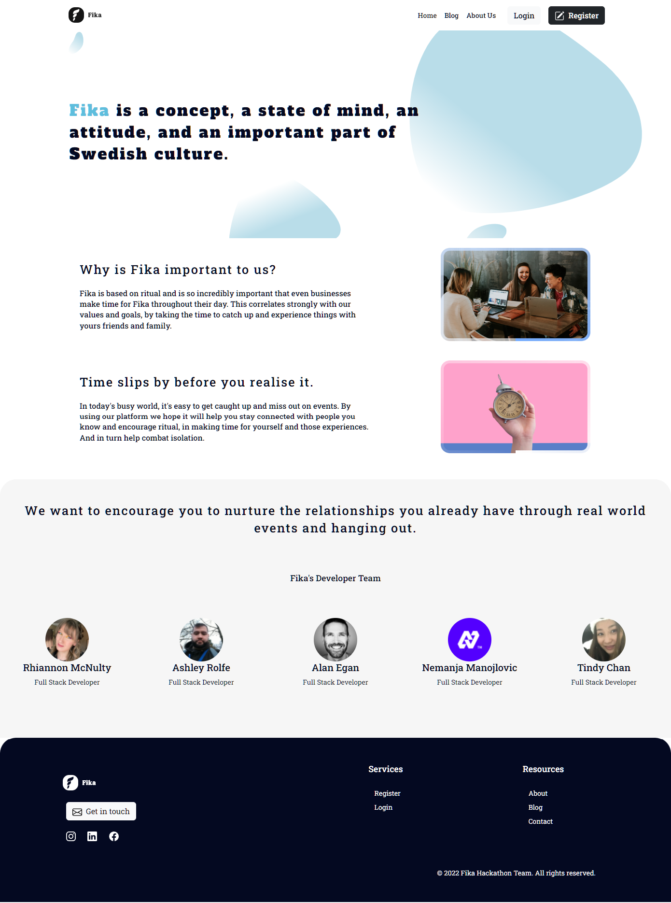

## Login Page

This page logs the user into their account. The page provides users with a username and password input where they must input their username and password correctly to access their account. 

This page again follows the same design structure as all pages on the site.

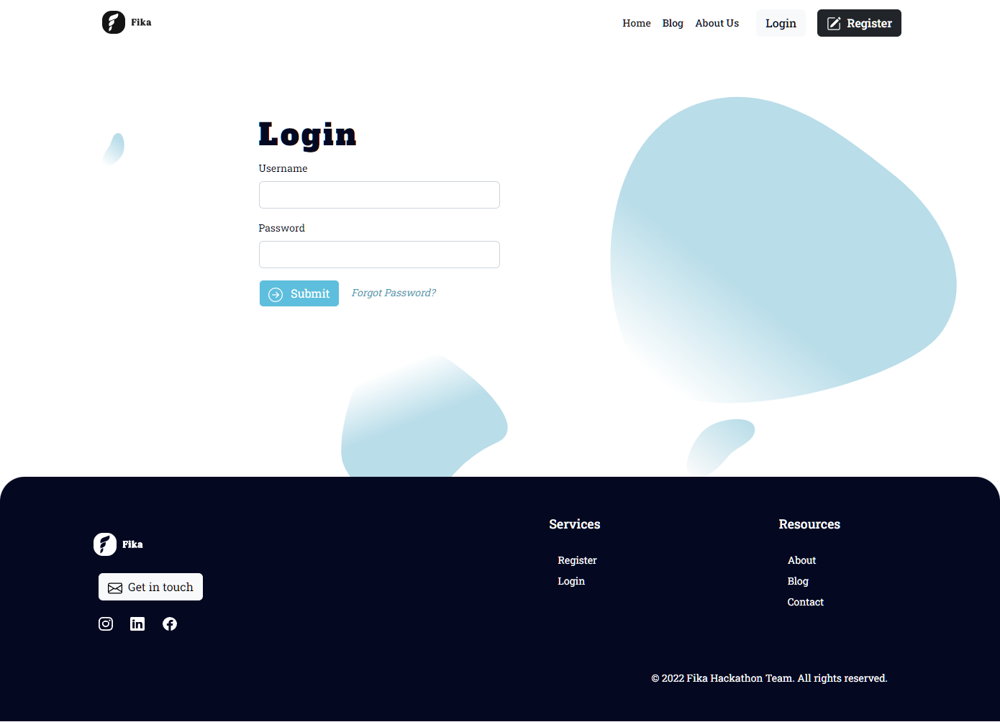

## Register Page

This page allows the user to create an account.

The user must enter a username, Full name, email and password. Each of the inputs are validated to prevent:
* submitting empty inputs
* submitting an email address without the correct format
* submitting passwords that do not match
* submitting passwords that do not match the criteria

This page again follows the same design structure as all pages on the site.

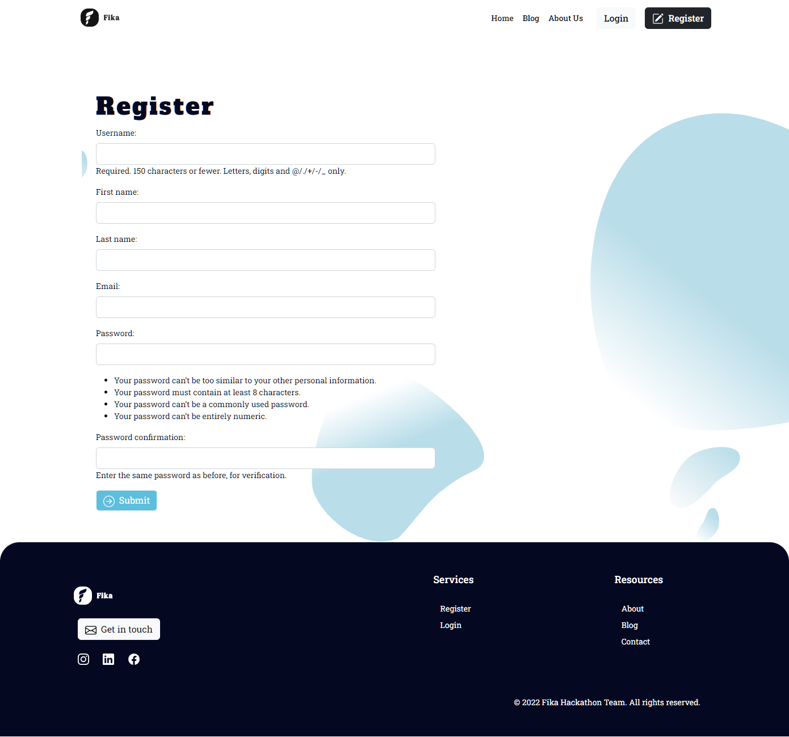

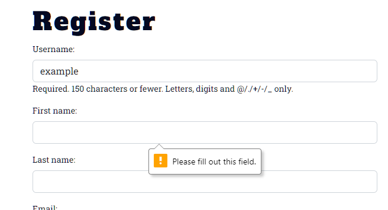

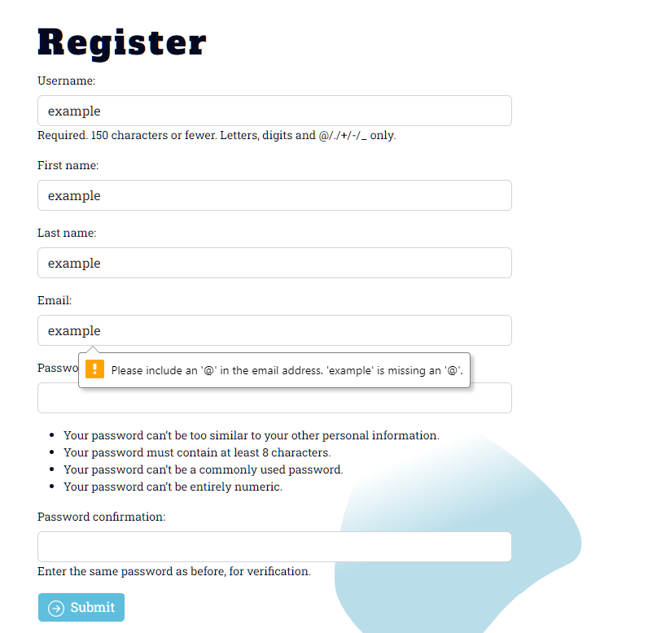

## Profile Page

The Profile page is the page the user is taken to when first registered or logged in. This page presents all the users details they entered when signing up.

## Contact Page

The contact page has a contact form in which the user can contact the dev team from. The contact page can be reached from the footer.

## Footer

The footer contains the Fika logo which redirects the user to the home page when pressed. It also contains links to take the user directly to the Home page, Blog page, About page, Login page and Register page when the user isn't signed in.

When the user is signed in, the footer will also contain link to take the user directly to the Events page, Add Event page, Connections page and their Profile page.

The footer also contains a "Get in Touch" button which will allow the user to email Fika. There are 3 social media icons that will take the user to Fika's Instagram, LinkedIn, and Facebook page when pressed.

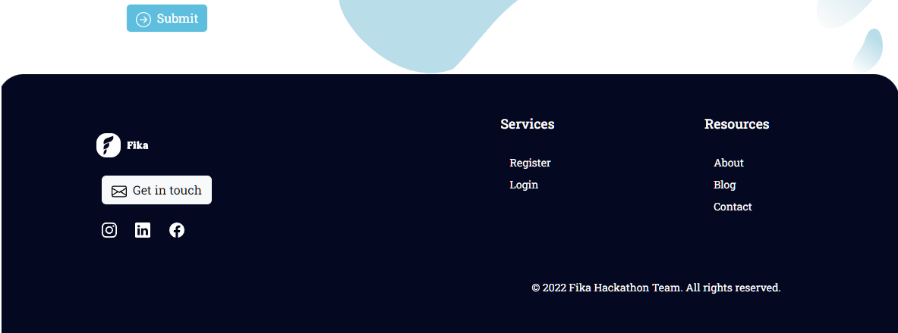

## Create Events

The creation of Events is at the core of our entire platform. The user has the ability to create events and those who are your friends have the option of going to the event.

The event could be as simple as you going to the gym, and you creating an event for it, allowing others to join if they so wish. Or it could be as elaborate as an engagement party etc.

The user can give the event a name and a time and date as well as a destination.

## Friend System

The idea of our platform is to connect you to friends and family, people you know, and like to spend time with. 

Therefore, there is a friend system implemented whereby your events will only be seen by your friends and you will only see friends events.

You can search profiles for your family or friends and add them. You can decline friend requests and unfriend people. 

[Back to top](<#contents>)

# Future Features

* An option for the user to comment on other users events as well as receive feedback on their own.

* An option for the user to upload an image of their own for the event.

* An option for a more detailed view of events

* Blog feature

[Back to top](<#contents>)

# Technologies Used

* HTML5 - Delivers the structure and content for the site.
* CSS3 - Provides the styling for the site
* Bootstrap 5 - HTML, CSS & JavaScript library
* JavaScript - Provides functionality to the site
* Python - To provide the functionality to the program
* Google Chrome DevTools - Used to debug
* Django - Python web framework
* Git - Version control
* GitHub - Used to host website

[Back to top](<#contents>)

# Acknowledgements

Fika was designed and built for the Code Institute May Hackathon 2022 in conjunction with SodaTrust. 

## Developer Team

* Nemanja Manojlovic - Scrum Master
* Alan Egan
* Ashley Rolfe
* Rhiannon McNulty
* Tindy Chan

[Back to top](<#contents>)